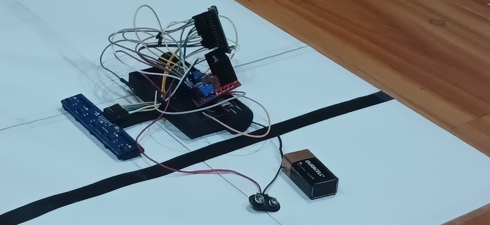
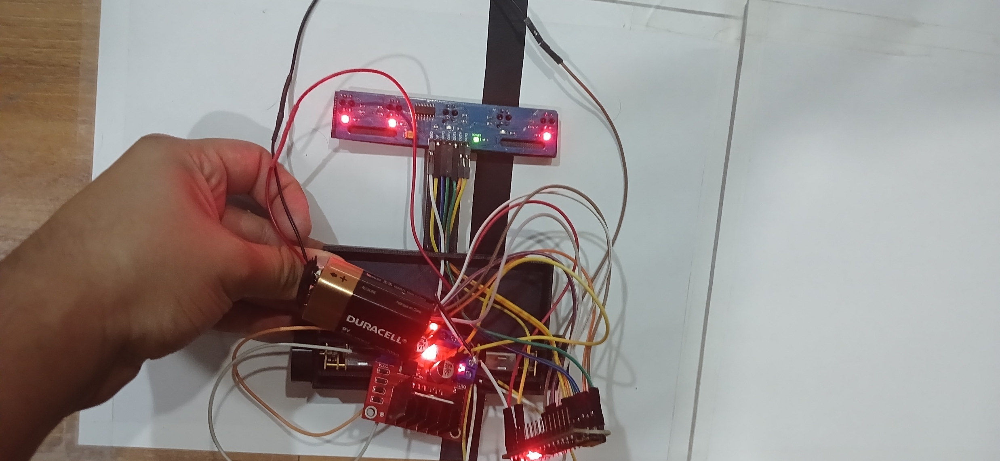
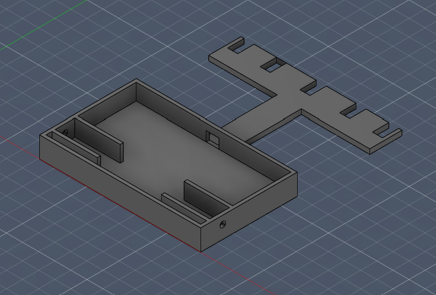
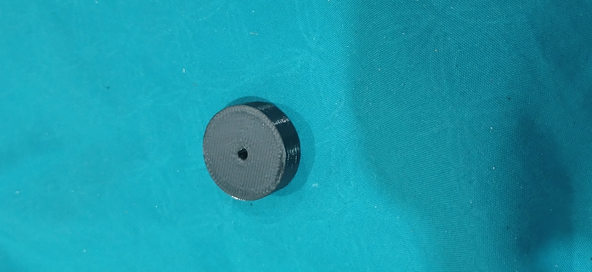
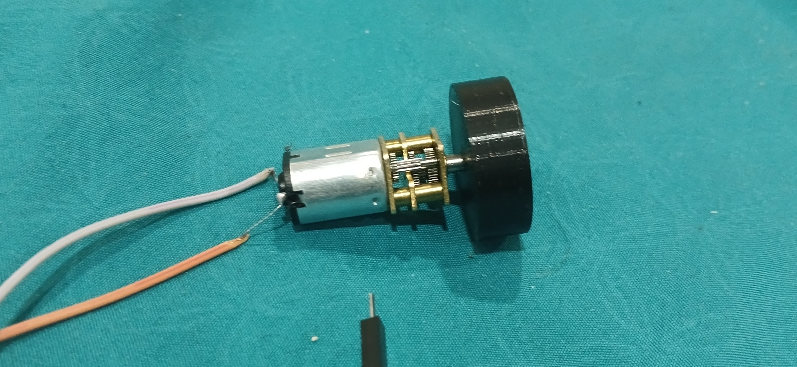

# Proyecto: Robot siguelineas

## Vista general

## 1. 🗒️ Descripción general

Robot autónomo capaz de seguir una linea, mediante sensores IR, control de motores diferencial y procesamiento por Arduino

## 2. 🎞️ Multimedia

## 3. 🚀 Características principales

- Lectura de sensores IR (señal analógica)
- Calibración manual (por software) por sensor
- Chasis diseñado e impreso en 3D
- Control diferencial en motores

## 4. ⚡ Hardware

- Arduino nano
- Driver L298N (por el momento)
- Array de sensores IR, modelo TCRT5000
- Motores DC tipo N20
- Batería de 9V (por el momento)

## 5. ⚙️ Diseño mecánico

Todo el diseño del robot fue modelado en 3D, utilizando Fusion 360

### Chasis

El chasis fue pensado para ser lo más ligero posible (no ser demasiado grueso principalmente), y lo suficientemente grande para que todos los componentes puedan caer sin problema. Se utilizó una tolerancia de 0.15mm para compensar la impresión 3D.

### Ruedas

Las ruedas fueron diseñadas para ser lo más pequeñas posibles, así evitando poner mucha carga al eje de los motores, ya que estas van encima directamente de ellos. Fueron impresas con PLA, pero este al ser un material muy rígido, hace que las ruedas patinen mucho.

## 6. 🧠 Funcionamiento

El robot utiliza sensores infrarrojos para distinguir el contraste entre el color negro y el blanco. Se utilizan lecturas analógicas y umbrales diferentes por cada sensor, debido a variaciones en su sensibilidad.

A partir de estas lecturas, el sistema estima la desviación respecto a la línea y ajusta la velocidad de cada motor, permitiendo corregir la trayectoria mediante control diferencial.

## 7. 🧪 Pruebas, problemas y aprendizajes

### ⚠️ Problemas encontrados

- Variación de sensibilidad entre los sensores
- Inestabilidad de la batería de 9V
- La lectura de los sensores depende de su distancia al suelo
- Hay muy poco espacio para componentes
- Las ruedas resbalan

### 🔍 Aprendizajes

- Los sensores requieren calibración individual
- La estabilidad de la alimentación afecta directamente al rendimiento del sistema completo
- El uso de lecturas analógicas en vez de digitales, permite mejorar la precisión y eficacia de los sensores
- El PLA no es el mejor material para ruedas, ya que es muy resbaladizo

## 8. 🔮 Mejoras futuras

- Implementar control PID para mejorar estabilidad
- Desarrollar un sistema de auto-calibración de sensores
- Mejorar sistema de alimentación (ej: usar baterías más estables)

## 9. 📂 Estructura

- /codigo -> programa Arduino
- /imagenes -> fotos del proyecto
- /stl -> modelos 3D del proyecto